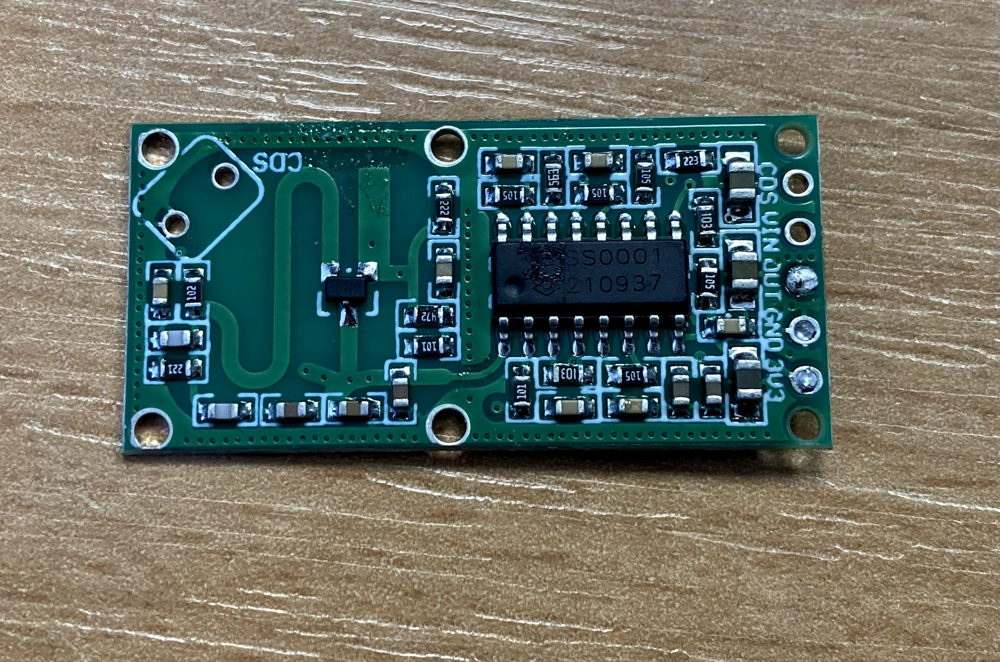

# NixieTicker
NixieTicker is a cryptocurrency price indicator that runs on ESP32 and uses nixies to display the value. 
### Nixie tubes use high voltage. Be careful!

## Hardware requirements  
6x Nixie tube ( for example IN14 )  
ESP32 WROOM  
6 digit Nixie Clock Board - for example from ebay
[Nixie Board](img/board.jpg)
12V 0,5A - 1A power supply

## Software requirements
VS Code with Platformio extension

## Preparing HW  
We will use ESP32 instead of onboard microcontroller from nixie board.

### 1) Desolder microcontroller from Nixie Clock Board   
   Protect other parts of the board when using the heat gun, otherwise it will melt.  
   
### 2) Solder wires from Nixie board to ESP
  There are 2 variants of STC8F1K08S2. SOP16 and TSSOP20, with different pinouts.
  ESP32 is powered from the voltage regulator on the Nixie board. The ESP controls the shift registers and the SHDN pin on the MAX1771, which turns the high voltage on and off for the nixies.

  #### SOP16
If you have SOP 16, you can solder the wires directly to where the microcontroller was placed. But you can you se alternative places mentioned later in TSSOP20.  

  | Nixie Board | ESP32 |
|-----------|-----------|
| 2 - Serial | D27 |
| 3 - HV Enable | D33 |
| 4 - RCLK | D26 |
| 6 - Vcc | 5V |
| 7 - SRCLK | D25 |
| 8 - GND | GND |

  #### TSSOP20
 Soldering pads for TSSOP20 ( smaller one ) are too small, so its easier to solder wires to other places.

  | Microcontroller | Alternative | ESP32 |
|-----------|-----------|-----------|
| 2 - Serial | pin 14 on first 74HC595 | D27 |
| 3 - RCLK | pin 12 on first 74HC595 | D26 |
| 4 - SRCLK | pin 11 on first 74HC595 | D25 |
| 6 - HV Enable | pin 4 on MAX1771 | D33 |
| 8 - VCC | pin 2 on AMS1117 | 5V |
| 10 - GND | pin 1 on AMS1117 | GND |

### 3) Backlight and Motion detector - optional

#### Enabling or disabling functions
At the beginning of the code, there are the following variables:
bool radarInstalled = 1;
bool LEDinstalled = 1;
If you are not using the radar or backlight, set these variables accordingly.

#### LED Backlight
I use six blue LEDs. My LEDs draw 20mA each, so I have three LEDs in series with a 120Ω resistor. You can use any generic NPN transistor for switching.
The positive lead of the LEDs is connected to the voltage regulator input on the Nixie board. The transistor's base is connected to D32. The ground ( emitor ) can be connected to either the ESP ground pin or the Nixie board ground, such as the voltage regulator ground.

The green wire provides 12V for the LEDs, the black wire is ground.

#### Motion Detector
I use a 3.3V Microwave Radar Motion Detector Sensor (RCWL-0516) from eBay. It can detect motion through my wooden enclosure, so no holes are required. It is powered by the ESP's 3.3V pin and ground. The sensor's output is connected to D14.

### 4) Connect nixie tubes and power supply to nixie board  

## Preparing SW
1) Clone this repo to your PC
2) Open it with Code
3) If you want to use Youtube Subs feature, you need to get youtube API key https://www.youtube.com/watch?v=N18czV5tj5o
4) In folder src open file main.h and add your API key here: const char* youtubeApiKey = "YOUR API KEY"; 
6) Connect your ESP and hit upload.
7) Connect Ticker to your network: https://youtu.be/hoB8hveIu14
